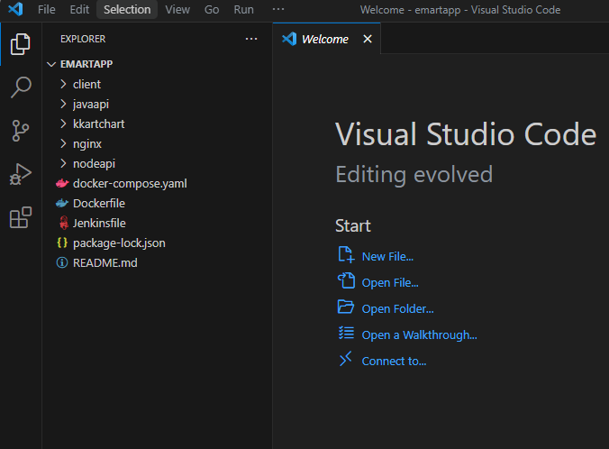
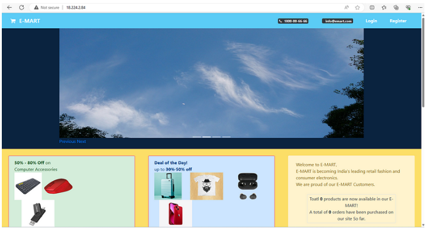

# Project-13: Containerization of a Microservice Application using Docker

[*Project Source*](https://medium.com/r/?url=https%3A%2F%2Fwww.udemy.com%2Fcourse%2Fdecodingdevops%2Flearn%2Flecture%2F31765674%23overview)


## Pre-requisities:
- DockerHub account
- AWS service


## Step-1: Clone the source code from Github

- Clone the source code but first, create a directory on git bash using the below commands
```sh
mkdir -p /c/microsvc
cd /c/microsvc/
git clone https://github.com/devopshydclub/emartapp.git
```


- Open the cloned source code on VScode using the commands below
```sh
ls 
cd emartapp/
code .
```



## Step-2: Dockerfile for Client Image[ANGULAR]

- Create an `app` directory under `Client` directory. Copy the below Multistage file  to a file named as `Dockerfile`.
```sh
FROM node:14 AS web-build
WORKDIR /usr/src/app
COPY ./ ./client
RUN cd client && npm install && npm run build --prod

# Use official nginx image as the base image
FROM nginx:latest

# Copy the build output to replace the default nginx contents.
COPY --from=web-build /usr/src/app/client/dist/client/ /usr/share/nginx/html
COPY nginx.conf /etc/nginx/conf.d/default.conf

# Expose port 4200
EXPOSE 4200
```

- We will create our own `nginxvproapp.conf` file under `web` directory with content below, and replaced in the container with default config file.
```sh
server {
    listen       4200;
    listen  [::]:4200;
    server_name  localhost;

    #access_log  /var/log/nginx/host.access.log  main;

    location / {
        root   /usr/share/nginx/html;
        index  index.html index.htm;
    }

    #error_page  404              /404.html;

    # redirect server error pages to the static page /50x.html
    #
    error_page   500 502 503 504  /50x.html;
    location = /50x.html {
        root   /usr/share/nginx/html;
    }

    # proxy the PHP scripts to Apache listening on 127.0.0.1:80
    #
    #location ~ \.php$ {
    #    proxy_pass   http://127.0.0.1;
    #}

    # pass the PHP scripts to FastCGI server listening on 127.0.0.1:9000
    #
    #location ~ \.php$ {
    #    root           html;
    #    fastcgi_pass   127.0.0.1:9000;
    #    fastcgi_index  index.php;
    #    fastcgi_param  SCRIPT_FILENAME  /scripts$fastcgi_script_name;
    #    include        fastcgi_params;
    #}

    # deny access to .htaccess files, if Apache's document root
    # concurs with nginx's one
    #
    #location ~ /\.ht {
    #    deny  all;
    #}
}
```

## Step-3: Dockerfile for Node API 

- Create an `app` directory under `NodeAPI` directory. Copy the below Multistage file to a file named as `Dockerfile`.
```sh
FROM node:14 AS nodeapi-build
WORKDIR /usr/src/app
COPY ./ ./nodeapi/
RUN cd nodeapi && npm install

FROM node:14
WORKDIR /usr/src/app/
COPY --from=nodeapi-build /usr/src/app/nodeapi/ ./
RUN ls
EXPOSE 5000
CMD ["/bin/sh", "-c", "cd /usr/src/app/ && npm start"]
# Test3
```

## Step-4: Dockerfile for JavaAPI

- Create an `app` directory under `JavaAPI` directory. Copy the below Multistage content to a file named as `Dockerfile`.
```sh
FROM openjdk:8 AS BUILD_IMAGE
WORKDIR /usr/src/app/
RUN apt update && apt install maven -y
COPY ./ /usr/src/app/
RUN mvn install -DskipTests
```

## Step-5: Dockerfile for Nginx

- For nginx we are not going to build an image but use official nginx image. We have a conf file of nginx which we will attach this to nginx official image as a volume.
```sh
#upstream api {
#    server api:5000; 
#}
#upstream webapi {
#    server webapi:9000;
#}
upstream client {
    server client:4200;
}
server {
    listen 80;
    location / {
        proxy_set_header Host $host;
        proxy_set_header X-Real-IP $remote_addr;
        proxy_set_header X-Forwarded-For $proxy_add_x_forwarded_for;
        proxy_set_header X-Forwarded-Proto $scheme; 

        proxy_http_version 1.1;
        proxy_set_header Upgrade $http_upgrade;
        proxy_set_header Connection "upgrade";
        proxy_pass http://client/;
    }
    location /api {
#        rewrite ^/api/(.*) /$1 break; # works for both /api and /api/
#        proxy_set_header Host $host;
#        proxy_set_header X-Real-IP $remote_addr;
#        proxy_set_header X-Forwarded-For $proxy_add_x_forwarded_for;
#        proxy_set_header X-Forwarded-Proto $scheme; 
#        proxy_http_version 1.1;

        proxy_pass http://api:5000;
    }
    location /webapi {
#        rewrite ^/webapi/(.*) /$1 break;
#        proxy_set_header Host $host;
#        proxy_set_header X-Real-IP $remote_addr;
##        proxy_set_header X-Forwarded-For $proxy_add_x_forwarded_for;
#        proxy_set_header X-Forwarded-Proto $scheme;
        proxy_pass http://webapi:9000;
    }
}
```

- Docker-composefile
```sh
version: "3.8"

services:
  client:
    build:
      context: ./client
    ports:
      - "4200:4200"
    container_name: client
    depends_on:
      - api
      - webapi

  api:
    build:
      context: ./nodeapi
    ports:
      - "5000:5000"
    restart: always
    container_name: api
    depends_on:
      - nginx
      - emongo

  webapi:
    build:
      context: ./javaapi
    ports:
      - "9000:9000"
    restart: always
    container_name: webapi
    depends_on:
      - emartdb

  nginx:
    restart: always
    image: nginx:latest
    container_name: nginx
    volumes:
      - "./nginx/default.conf:/etc/nginx/conf.d/default.conf"
    ports:
      - "80:80"

  emongo:
    image: mongo:4
    container_name: emongo
    environment:
      - MONGO_INITDB_DATABASE=epoc
    ports:
      - "27017:27017"

  emartdb:
    image: mysql:8.0.33
    container_name: emartdb
    ports:
      - "3306:3306"
    environment:
      - MYSQL_ROOT_PASSWORD=emartdbpass
      - MYSQL_DATABASE=books
```

## Step-6: Run the build process
- We will launch an EC2 instance and run the build process on it
```sh
Name : DockerEngine
AMI: Ubuntu 20.04
Instance Type: t3 medium
Keypair: dockerkey
Volume size: 20gb
```

- ps: Instance type will be t3.medium as we need more RAM
- Userdata
```sh
#!/bin/bash

# Install docker on Ubuntu
sudo apt-get update
   sudo apt-get install \
    ca-certificates \
    curl \
    gnupg \
    lsb-release -y
   curl -fsSL https://download.docker.com/linux/ubuntu/gpg | sudo gpg --dearmor -o /usr/share/keyrings/docker-archive-keyring.gpg
   echo \
  "deb [arch=$(dpkg --print-architecture) signed-by=/usr/share/keyrings/docker-archive-keyring.gpg] https://download.docker.com/linux/ubuntu \
  $(lsb_release -cs) stable" | sudo tee /etc/apt/sources.list.d/docker.list > /dev/null

# Install docker-compose
   sudo apt-get update
   sudo apt-get install docker-ce docker-ce-cli containerd.io -y
   sudo curl -L "https://github.com/docker/compose/releases/download/1.29.2/docker-compose-$(uname -s)-$(uname -m)" -o /usr/local/bin/docker-compose
   sudo chmod +x /usr/local/bin/docker-compose

# Add ubuntu user into docker group
    sudo usermod -a -G docker ubuntu
```

- SSH into the ec2 instance and fetch the source code
```sh
ssh -i Downloads/dockerkey.pem ubuntu@<public ip>
git clone https://github.com/devopshydclub/emartapp.git
ls
cd emartapp/
ls
```

## Step-7: Build

- Build the images, then run the container
```sh
docker-compose build
docker images
docker-compose up
```


- Access the API gateway (Nginx)


## Step-7: Clean up

```sh
docker-compose down
```

